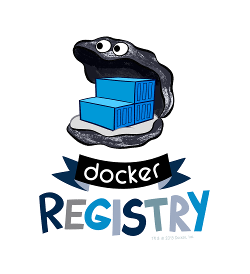

# Docker Registry

Deploy a Docker Registry on a Jelastic hoster in one click.

1. On the Jelastic console, click on Import and select the URL tab.
2. Paste this URL in the input field : https://raw.githubusercontent.com/HidoraSwiss/manifest-registry/master/manifest.jps and click on Import.
3. Provide a name for your new environnement and then click on Install.

After installation, you can easily pull & push images to your registry:

```bash
docker pull alpine
docker tag alpine <registry-url>/myalpine
docker login <registry-url>
docker push <registry-url>/myalpine
```

Configuration can be adjusted in `/etc/docker/registry/config.yml`.

> See [documentation of Docker Registry](https://docs.docker.com/registry/) for more details and configuration.
